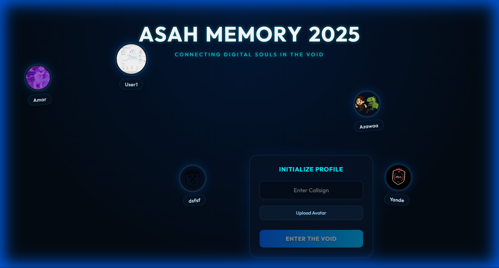

# 🌌 Asah Memory 2025


> *"Connecting Digital Souls in the Void"*

A mesmerizing, immersive web experience that creates a shared digital memory space. Users can project their identities as floating, interactive avatars in a cosmic blue void. Built with modern web technologies to deliver a premium, glass-morphic aesthetic.



## ✨ Features

-   **Immersive Blue Glass Aesthetic**: A deeply curated UI featuring frosted glass cards, neon cyan accents, and CRT-style scanline overlays.
-   **Floating Avatar System**: User profiles float organically in 3D space with randomized trajectories and physics-based animations.
-   **Multi-User Persistence**: Add multiple "souls" to the void. Data is persisted locally using `localStorage`, keeping the memory alive across sessions.
-   **Interactive Experience**:
    -   **Hover Effects**: Avatars scale and glow on interaction.
    -   **Entrance Animations**: Title letters stagger in with spring dynamics.
    -   **Real-time Preview**: Instant visual feedback when creating a new profile.
-   **Responsive Design**: The ethereal void adjusts to fit any viewport size seamlessly.

## 🛠️ Tech Stack

-   **Framework**: [React 18](https://reactjs.org/)
-   **Build Tool**: [Vite](https://vitejs.dev/)
-   **Animation**: [Framer Motion](https://www.framer.com/motion/)
-   **Styling**: Vanilla CSS (Variables & Modules) with a focus on CSS Filters (`backdrop-filter`) and advanced gradients.
-   **Fonts**: [Outfit](https://fonts.google.com/specimen/Outfit) (Google Fonts).

## 🚀 Getting Started

Follow these steps to deploy your own memory space locally.

### Prerequisites

-   Node.js (v16.0.0 or higher)
-   npm or yarn

### Installation

1.  **Clone the repository**
    ```bash
    git clone https://github.com/yourusername/asaha-memory.git
    cd asaha-memory
    ```

2.  **Install dependencies**
    ```bash
    npm install
    # or
    yarn install
    ```

3.  **Run the development server**
    ```bash
    npm run dev
    ```

4.  **Open the void**
    Navigate to `http://localhost:5173` in your browser.

## 📁 Project Structure

```
asaha-memory/
├── public/             # Static assets
│   └── preview.png     # Project screenshot
├── src/
│   ├── components/
│   │   ├── FloatingAvatar.jsx  # The drifting user profile component
│   │   └── ProfileControls.jsx # The glass-morphic input interface
│   ├── App.jsx         # Main application logic & layout
│   ├── App.css         # Component-specific styles
│   ├── index.css       # Global theme variables & resets
│   └── main.jsx        # Entry point
├── index.html          # HTML Entry
├── vite.config.js      # Vite configuration
└── package.json        # Dependencies & Scripts
```

## 🎨 Customization

The project uses CSS variables in `src/index.css` for easy theming. You can adjust the "void" colors here:

```css
:root {
  --bg-color: #030b14;        /* Deep background */
  --accent-cyan: #00f2ff;     /* Neon glow color */
  --glass-bg: rgba(5, 20, 40, 0.6); /* Card opacity */
}
```

## 🤝 Contributing

Contributions are welcome! If you have ideas for new features (e.g., WebSocket networking for real-time multiplayer, audio ambience, etc.), feel free to fork and submit a Pull Request.

## 📄 License

This project is open-source and available under the [MIT License](LICENSE).
