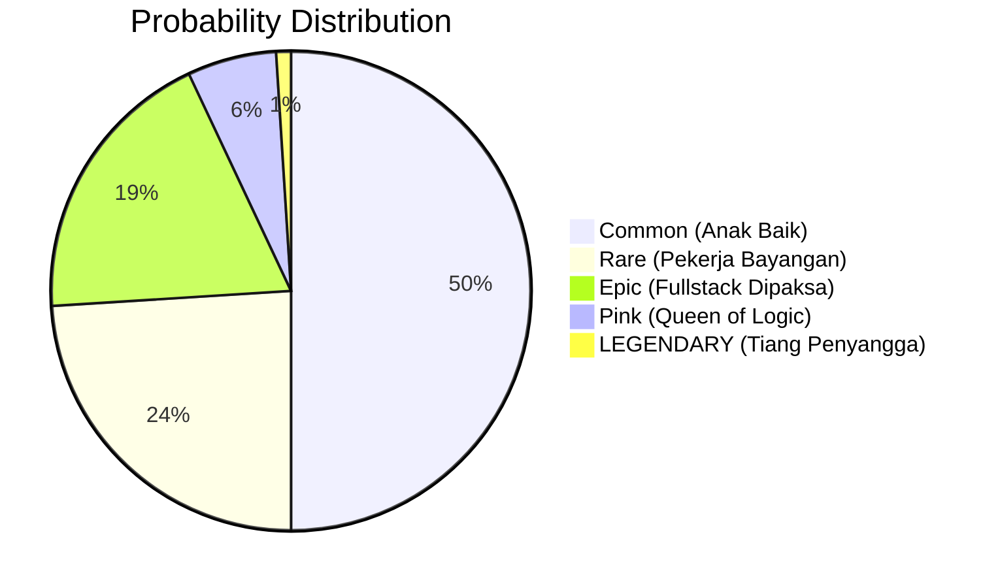
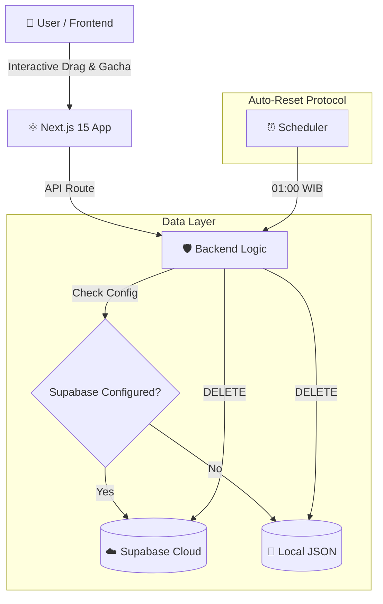
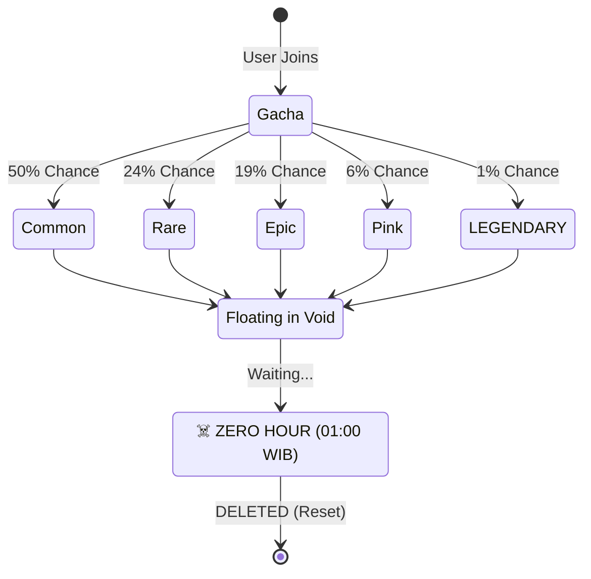
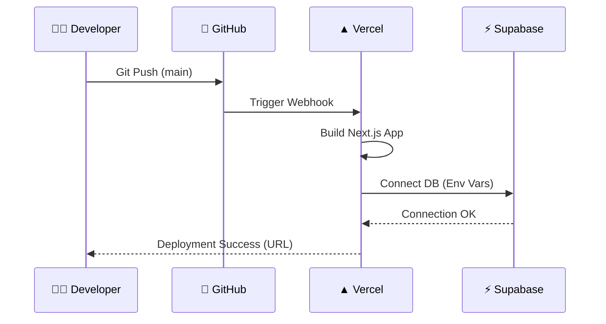

```text
    _    ____    _    _   _    __  __ _____ __  __  ___  ____  ___ 
   / \  / ___|  / \  | | | |  |  \/  | ____|  \/  |/ _ \|  _ \|_ _|
  / _ \ \___ \ / _ \ | |_| |  | |\/| |  _| | |\/| | | | | |_) || | 
 / ___ \ ___) / ___ \|  _  |  | |  | | |___| |  | | |_| |  _ < | | 
/_/   \_\____/_/   \_\_| |_|  |_|  |_|_____|_|  |_|\___/|_| \_\___|
                                               EST. 2025 • DIGITAL VOID
```

   

**Selamat datang di Digital Void** — Tempat di mana jiwa-jiwa digital bertemu, terhubung, dan menghilang. Asah Memory bukan sekadar galeri, ini adalah *sandbox interaktif* antariksa. Profil teman-temanmu tidak diam; mereka melayang, memantul, dan hidup dalam orbit abadi (setidaknya sampai jam 1 pagi).

---

## ✨ Fitur Utama (The Features)

*   **🎲 Gacha Fate System**: Saat bergabung, nasib coding Anda diundi! Dapatkan gelar lucu mulai dari *Common* hingga *Legendary* dengan aura khusus.
*   **☄️ Physics-Based Drag**: Avatar bisa dilempar, memantul di layar, dan berinteraksi secara fisik. (Try throwing them!).
*   **⏰ Protocol: ZERO HOUR**: Tepat pukul **01:00 WIB**, "Kiamat Kecil" terjadi. Semua avatar dihapus. Void kembali bersih. Kenangan hari itu menjadi sejarah.
*   **🎨 Dynamic Visuals**: Font 'Permanent Marker', efek coretan krayon, dan **Aura Merah Berputar** yang mengintimidasi untuk para *Legends*.
*   **📱 Responsif Sempurna**: Indah di Desktop, Nyaman di Mobile.

### 🏆 Daftar Gelar & Probabilitas

Nasibmu ditentukan oleh algoritma. Siapakah kamu sebenarnya?



| Rarity | Chance | Contoh Gelar | Efek Visual |
| :--- | :---: | :--- | :--- |
| **⚪ Common** | 50% | *Kerja Tanpa Riuh, Anak Baik* | Badge Abu-abu |
| **🔵 Rare** | 24% | *Penambal Lubang, Pekerja Bayangan* | Badge Biru + Glow |
| **🟣 Epic** | 19% | *Satu Orang Banyak Peran, Fullstack Dipaksa* | Badge Ungu + Neon |
| **💗 Pink** | 6% | *Queen of Logic, UI/UX Goddess* | **Badge Pink + Aura Cinta (<3)** |
| **🔴 LEGENDARY** | **1%** | ***Tiang Penyangga Kelompok, Penggendong Handal*** | **Aura Merah Berputar & Emas** |

---


## 🛠️ Teknologi

---

## 🛠️ Arsitektur Sistem (Visualized)

Bagaimana cara kerjanya?



*   **[Next.js 15](https://nextjs.org/)**: Framework React utama (App Router).
*   **[React 19](https://react.dev/)**: Library UI.
*   **[Framer Motion](https://www.framer.com/motion/)**: Untuk animasi orbit kompleks dan transisi.
*   **[Vercel KV / Supabase](https://supabase.com/)**: Opsional, untuk penyimpanan data persisten di cloud.

---

## 🔄 Siklus Hidup Avatar (The Loop)



## 🚀 Panduan Instalasi (Lokal)

Ingin menjalankan project ini di komputer Anda sendiri? Ikuti langkah mudah ini:

### 1. Prasyarat
Pastikan Anda sudah menginstall [Node.js](https://nodejs.org/) (Versi 18 LTS atau terbaru).

---

## 🎮 Controls & Interactions

Cara bermain di sandbox ini:

| Action | Icon | Effect |
| :--- | :---: | :--- |
| **Hover** | 👆 | **Scan Identity** (Melihat Title & Aura) |
| **Click** | 🖱️ | **Open Detail** (Pop-up Kartu Identitas) |
| **Drag** | ✊ | **Throw Avatar** (Lempar!) |
| **Wait** | ⏳ | **Observe Orbit** (Lihat rotasi alami) |

---

### 2. Instalasi & Jalankan
Buka terminal di folder project dan jalankan perintah:

```bash
# Instal semua dependensi
npm run install-all

# Jalankan server development
npm run dev
```

Buka [http://localhost:3000](http://localhost:3000) di browser Anda.

---

## ☁️ Panduan Deployment (Visualized)

Langkah mudah menuju awan:



### 1. Push ke GitHub
Upload kode ini ke repository GitHub Anda.

### 2. Import di Vercel
Buka dashboard [Vercel](https://vercel.com), buat project baru, dan import repository GitHub tadi.

### 3. Setup Database (Supabase)
Karena Vercel bersifat *serverless* (file lokal akan hilang saat restart), Anda wajib menggunakan database cloud seperti Supabase agar data profil tersimpan permanen.

1.  Buat project di [Supabase.com](https://supabase.com/).
2.  Jalankan perintah SQL ini di "SQL Editor" Supabase:
    ```sql
    create table profiles (
      id bigint generated by default as identity primary key,
      content jsonb not null,
      created_at timestamp with time zone default timezone('utc'::text, now()) not null
    );
    ```
3.  Di Dashboard Vercel (Menu **Settings > Environment Variables**), tambahkan:
    *   `NEXT_PUBLIC_SUPABASE_URL`: (URL Project Supabase Anda)
    *   `NEXT_PUBLIC_SUPABASE_ANON_KEY`: (Anon Key Supabase Anda)

4.  **Redeploy** (atau deploy ulang) project Anda di Vercel.

---

## 📂 Struktur Project

```text
/
├── frontend/
│   ├── src/app/           # Next.js App Router (Halaman & API)
│   ├── src/components/    # Komponen (Avatar, Modal, dll)
│   ├── src/lib/           # Konfigurasi Supabase
│   └── data/              # Fallback penyimpanan lokal
├── package.json           # Skrip utama
└── README.md              # Dokumentasi ini
```

---

## 🤝 Kontribusi

Konsep atau ide baru? Silakan fork repository ini dan kirimkan Pull Request!

## 📝 Lisensi

Dibuat dengan Cinta dan malam untuk **Teman-teman Asah**.
Dilindungi di bawah lisensi [MIT](LICENSE).
