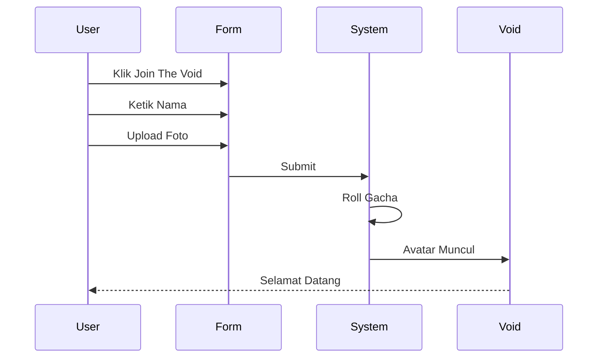

```text
    _    ____    _    _   _    __  __ _____ __  __  ___  ____  ___ 
   / \  / ___|  / \  | | | |  |  \/  | ____|  \/  |/ _ \|  _ \|_ _|
  / _ \ \___ \ / _ \ | |_| |  | |\/| |  _| | |\/| | | | | |_) || | 
 / ___ \ ___) / ___ \|  _  |  | |  | | |___| |  | | |_| |  _ < | | 
/_/   \_\____/_/   \_\_| |_|  |_|  |_|_____|_|  |_|\___/|_| \_\___|
                                               EST. 2025 • DIGITAL VOID
```

   

**Selamat datang di Digital Void** — Tempat di mana jiwa-jiwa digital bertemu, terhubung, dan bertarung. Asah Memory bukan sekadar galeri, ini adalah *interactive playground* coding. Profil teman-temanmu tidak diam; mereka melayang, bertarung, dan hidup dalam orbit abadi (setidaknya sampai jam 1 pagi).

---

## ✨ Fitur Utama (The Features)

### 1. 🌌 The Void (Floating Lobby)
*   **☄️ Physics-Based Drag**: Avatar bisa dilempar, memantul di layar, dan berinteraksi secara fisik.
*   **🎲 Gacha Fate System**: Nasib coding Anda diundi! Dapatkan gelar lucu dengan visual unik.
*   **🏆 Win Streak Badge**: Jika Champion Anda menang berturut-turut, lencananya akan bersinar di layar utama.
*   **⏱️ Auto-Expiry System**: Avatar otomatis dihapus setelah 30 menit untuk menjaga kesegaran tampilan.

### 2. 📌 Mading Board (Digital Bulletin)
*   **📝 Interactive Posting**: Tempelkan pesan, catatan, atau kenangan di papan digital bersama.
*   **🎨 Ransom Note Style**: Setiap post tampil dengan estetika "ransom note" yang unik — teks dengan efek gunting & tempel.
*   **🖼️ Grid Layout**: Tampilan responsive 3 kolom (desktop), 2 kolom (tablet), 1 kolom (mobile).
*   **🔍 Modal View**: Klik post untuk melihat detail dalam tampilan yang lebih besar.
*   **💾 Persistent Storage**: Semua post tersimpan di Supabase dan ditampilkan real-time.
*   **🎭 Visual Effects**: Setiap post memiliki tape/selotip visual dan efek hover yang interaktif.

### 3. ⚔️ Cinematic PVP Arena
*   **🎬 Visual Battle**: Bukan cuma teks! Saksikan avatar Anda melakukan **Lunge Attack**, efek **Screen Shake**, dan **Floating Damage Numbers**.
*   **🔗 Host-Authoritative Sync**: Tidak ada lagi *"di layarku menang, di layarmu kalah"*. Host menghitung RNG, hasilnya dikirim real-time ke lawan.
*   **☠️ Permadeath**: Kalah battle? Champion Anda **HANCUR** (Dihapus dari localStorage). Gacha ulang dari nol.
*   **💥 Critical Hit & Dodge**: Sistem combat yang dinamis dengan peluang critical damage dan evasion.

### 4. ⏰ Protocol: ZERO HOUR
*   Tepat pukul **01:00 WIB**, "Kiamat Kecil" terjadi. Semua avatar dihapus. Void kembali bersih. Kenangan hari itu menjadi sejarah.

---

## 🎲 Sistem Gacha & Rarity

Nasibmu ditentukan oleh algoritma. Siapakah kamu sebenarnya dalam hierarki kode?

| Rarity | Chance | Contoh Gelar | Visual Effect |
| :--- | :---: | :--- | :--- |
| **⚪ Common** | 50% | *Anak Baik, NPC* | Badge Abu-abu |
| **🔵 Rare** | 24% | *Penambal Lubang, Debugger* | Badge Biru + Glow |
| **🟣 Epic** | 19% | *Fullstack Dipaksa* | Badge Ungu + Neon |
| **💗 Pink** | 6% | *Queen of Logic* | **Badge Pink + Aura Cinta** |
| **🔴 LEGENDARY** | **1%** | ***Tiang Penyangga*** | **Aura Emas Berputar & Api** |

---

## ⚔️ Statistik Pertarungan (Competitive Stats)

Tidak semua Champion diciptakan setara. Pilih strategimu!

| Rarity | HP | DMG | Critical Chance 💥 | Dodge Chance 💨 | Playstyle |
| :--- | :---: | :---: | :---: | :---: | :--- |
| **Legendary** | 400 | 40 | **25%** | 10% | **Aggressive God** |
| **Pink** | 300 | 35 | 15% | **25%** | **Tricky / Evasive** |
| **Epic** | 200 | 25 | 10% | 5% | Balanced Elite |
| **Rare** | 120 | 15 | 5% | 0% | Standard Soldier |
| **Common** | 80 | 10 | 0% | 0% | Cannon Fodder |

> **Critical Hit**: Damage x1.5 (Teks Oranye)
> **Dodge**: Damage 0 (Teks Biru "MISS!")

---

## 🛠️ Arsitektur Sistem (Visualized)

```
                    ┌────────────────┐
                    │   👤 User      │
                    └─────┬─────┬─────┘
                         │     │
           ┌─────────┼─────┼─────────┐
           │         │     │         │
      ┌────┴────┐  │  ┌────┴────┐  ┌────┴────┐
      │ Next.js │  │  │ Battle  │  │  Mading  │
      │ Frontend│  │  │  Page   │  │  Board   │
      └───┬─┬───┘  │  └───┬────┘  └───┬────┘
          │ │      │      │          │
          │ └──────┼──────┼──────────┘
          │         │      │
          │    ┌────┴──────┐
          │    │ ☁️ Supabase │
          │    │  Database  │
          │    └──────────┘
          │
     ┌────┴───────────┐
     │ 📱 Realtime    │
     │   Broadcast     │
     └───────────────┘
```

**Data Flow:**
- 👤 **User** → Akses via Next.js Frontend / Battle Page / Mading Board
- ☁️ **Supabase DB** → Persistent storage untuk avatars & mading posts
- 📱 **Realtime Broadcast** → Sync battle state antar pemain
- 💾 **LocalStorage** → Win streak & champion data

---

## 📖 Panduan Pengguna (User Guide)

Berikut adalah panduan visual cara menggunakan setiap fitur di Asah Memory:

### 🎮 Cara Join ke The Void



**Langkah Detail:**
1. **Buka halaman utama** - Klik tombol biru **"Join The Void"**
2. **Isi nama** - Ketik nama atau nickname Anda
3. **Upload foto** (opsional) - Klik area upload untuk pilih foto profil
4. **Submit** - Klik tombol "Submit"
5. **Tunggu magic** - Sistem akan:
   - 🎲 Mengundi rarity Anda (Common sampai Legendary)
   - 🏷️ Memberikan title lucu sesuai rarity
   - ✨ Menampilkan avatar Anda di Void dengan efek visual unik

> 💡 **Easter Egg**: Ada cara rahasia untuk memanipulasi gacha... Coba eksperimen dengan nama yang Anda ketik!

---

### 📌 Cara Posting di Mading Board

**Flow Diagram:**
```
👤 User
  │
  │ 1. Klik Tab "Mading"
  ↓
📌 Mading Board
  │
  │ 2. Klik "Tempel Tulisan"
  ↓
📝 Form Input
  ├── Nama
  ├── Pesan
  └── Foto? ┌─── Ya → Upload
           └─── Tidak → Skip
  │
  │ 3. Submit
  ↓
✅ Post Muncul di Grid
  │
  │ 4. Klik untuk zoom
  ↓
🔍 Detail Modal View
```

**Langkah Detail:**
1. **Buka Mading Board** - Klik tab **"Mading"** di navigation
2. **Klik "📌 Tempel Tulisan"** - Tombol biru sticky di atas
3. **Isi Form:**
   - 👤 **Nama**: Siapa yang nulis
   - 💬 **Pesan**: Tulis catatan/kenangan (max 500 karakter)
   - 🖼️ **Foto** (opsional): Upload gambar pendukung
4. **Submit** - Klik "Tempel!"
5. **Post Muncul** - Tulisan Anda akan muncul di grid dengan:
   - 🎨 Style "ransom note" unik
   - 📐 Rotasi random (-5° sampai +5°)
   - 🎭 Tape/selotip visual di atas

**Interaksi:**
- **Hover** pada post → Efek shadow & lift
- **Klik** post → Detail view modal (lebih besar)
- **Klik background modal** → Kembali ke grid

> ⚠️ **Note**: Mading posts **PERMANEN** (tidak kena ZERO HOUR!)

---

### ⚔️ Cara Battle PVP

**Battle State Flow:**
```
START
  │
  ↓ Create/Join Room
🚪 LOBBY
  │
  ↓ Wait for opponent
⏳ WAITING (2 Players)
  │
  ↓ Both Ready
⚔️ BATTLE START!
  │
  │ ┌───────── Loop ─────────┐
  │ │                              │
  ↓ │                              │
🎯 ATTACK                          │
  │                                │
  ↓ RNG Calculate                  │
  ├─── 💥 Critical (x1.5 DMG)        │
  ├─── 💨 Dodge (MISS!)              │
  └─── ⚔️ Normal Hit                  │
       │                            │
       ↓ Check HP                   │
       ├─── HP > 0 ──────────────┘
       │
       └─── HP <= 0
            │
            ↓
         🏆 VICTORY!
            │
            ↓
          END
```

**Langkah Detail:**

**A. Memulai Battle:**
1. **Pastikan Anda sudah join Void** (punya Champion)
2. **Klik tombol "⚔️ Battle"** di halaman utama
3. **Pilih Mode:**
   - **Host Room**: Buat room baru → Dapat Room Code
   - **Join Room**: Masukkan Room Code dari teman

**B. Dalam Battle:**
1. **Giliran Host** (Player 1):
   - Host klik **"Attack"**
   - Sistem menghitung:
     - 💥 Critical? (Chance based on rarity)
     - 💨 Dodge? (Chance based on rarity)
     - 🎯 Normal damage
2. **Sinkronisasi Real-time**:
   - Damage number muncul di kedua layar
   - HP bar update otomatis
   - Screen shake & lunge animation
3. **Giliran berganti** ke Player 2
4. **Repeat** sampai salah satu HP = 0

**C. Hasil Battle:**
- 🏆 **Menang**: 
  - Win Streak +1 (tersimpan di localStorage)
  - Badge streak muncul di homepage
- ☠️ **Kalah**: 
  - **PERMADEATH** - Champion Anda dihapus
  - Harus gacha ulang dari nol

**Visual Indicators:**
- 🟠 **Orange Text** = Critical Hit (DMG x1.5)
- 🔵 **Blue "MISS!"** = Dodge successful
- ⚪ **White Numbers** = Normal damage

---

### ⏰ Protocol: ZERO HOUR Explained

**Timeline Visual:**
```
00:00 ━━━━━━━━━━━━━━━━━━━━━━━━━━━ 24:00
         ↓ 01:00 WIB
      [ZERO HOUR]
      🗑️ Cleanup
```

**Apa itu ZERO HOUR?**
- Setiap hari tepat **01:00 WIB**, sistem melakukan "Kiamat Kecil"
- **Semua avatar dihapus** dari database
- Void kembali bersih
- Kenangan hari itu menjadi sejarah

**Apa yang TERHAPUS:**
- ✅ Avatar Profiles di The Void
- ✅ Gacha titles dan rarity

**Apa yang AMAN:**
- ❌ **Mading Board Posts** (Permanen!)
- ❌ Win Streak badges (localStorage)

**Auto-Expiry (30 Menit):**
- Selain ZERO HOUR, avatar juga auto-expire setelah 30 menit
- Ini menjaga Void tetap fresh dan tidak overcrowded

---

## 🚀 Panduan Instalasi (Development)

Ingin menjalankan project ini di komputer Anda sendiri?

### 1. Prasyarat
Pastikan Anda sudah menginstall [Node.js](https://nodejs.org/) (Versi 18+).

### 2. Setup Env
Buat file `.env.local` di folder `Fullstack/` dan isi dengan kunci Supabase Anda:
```env
NEXT_PUBLIC_SUPABASE_URL=https://your-project.supabase.co
NEXT_PUBLIC_SUPABASE_ANON_KEY=your-anon-key
```

### 3. Jalankan Aplikasi
```bash
# Masuk ke folder Fullstack
cd Fullstack

# Install dependensi
npm install

# Jalankan server
npm run dev
```
Buka [http://localhost:3000](http://localhost:3000) dan mulai petualangan!

---

## 🤝 Kontribusi & Lisensi

Dibuat dengan 💻, ☕, dan sedikit 😡 debugging.
Dilindungi oleh lisensi [MIT](LICENSE). Bebas digunakan, dilarang dijual mahal-mahal.
```
