```text
    _    ____    _    _   _    __  __ _____ __  __  ___  ____  ___ 
   / \  / ___|  / \  | | | |  |  \/  | ____|  \/  |/ _ \|  _ \|_ _|
  / _ \ \___ \ / _ \ | |_| |  | |\/| |  _| | |\/| | | | | |_) || | 
 / ___ \ ___) / ___ \|  _  |  | |  | | |___| |  | | |_| |  _ < | | 
/_/   \_\____/_/   \_\_| |_|  |_|  |_|_____|_|  |_|\___/|_| \_\___|
                                               EST. 2025 • DIGITAL VOID
```

   

**Selamat datang di Digital Void** — Tempat di mana jiwa-jiwa digital bertemu, terhubung, dan bertarung. Asah Memory bukan sekadar galeri, ini adalah *interactive playground* coding. Profil teman-temanmu tidak diam; mereka melayang, bertarung, dan hidup dalam orbit abadi (setidaknya sampai jam 1 pagi).

---

## ✨ Fitur Utama (The Features)

### 1. 🌌 The Void (Floating Lobby)
*   **☄️ Physics-Based Drag**: Avatar bisa dilempar, memantul di layar, dan berinteraksi secara fisik.
*   **🎲 Gacha Fate System**: Nasib coding Anda diundi! Dapatkan gelar lucu dengan visual unik.
*   **🏆 Win Streak Badge**: Jika Champion Anda menang berturut-turut, lencananya akan bersinar di layar utama.
*   **⏱️ Auto-Expiry System**: Avatar otomatis dihapus setelah 30 menit untuk menjaga kesegaran tampilan.

### 2. 📌 Mading Board (Digital Bulletin)
*   **📝 Interactive Posting**: Tempelkan pesan, catatan, atau kenangan di papan digital bersama.
*   **🎨 Ransom Note Style**: Setiap post tampil dengan estetika "ransom note" yang unik — teks dengan efek gunting & tempel.
*   **🖼️ Grid Layout**: Tampilan responsive 3 kolom (desktop), 2 kolom (tablet), 1 kolom (mobile).
*   **🔍 Modal View**: Klik post untuk melihat detail dalam tampilan yang lebih besar.
*   **💾 Persistent Storage**: Semua post tersimpan di Supabase dan ditampilkan real-time.
*   **🎭 Visual Effects**: Setiap post memiliki tape/selotip visual dan efek hover yang interaktif.

### 3. ⚔️ Cinematic PVP Arena
*   **🎬 Visual Battle**: Bukan cuma teks! Saksikan avatar Anda melakukan **Lunge Attack**, efek **Screen Shake**, dan **Floating Damage Numbers**.
*   **🔗 Host-Authoritative Sync**: Tidak ada lagi *"di layarku menang, di layarmu kalah"*. Host menghitung RNG, hasilnya dikirim real-time ke lawan.
*   **☠️ Permadeath**: Kalah battle? Champion Anda **HANCUR** (Dihapus dari localStorage). Gacha ulang dari nol.
*   **💥 Critical Hit & Dodge**: Sistem combat yang dinamis dengan peluang critical damage dan evasion.

### 4. ⏰ Protocol: ZERO HOUR
*   Tepat pukul **01:00 WIB**, "Kiamat Kecil" terjadi. Semua avatar dihapus. Void kembali bersih. Kenangan hari itu menjadi sejarah.

---

## 🎲 Sistem Gacha & Rarity

Nasibmu ditentukan oleh algoritma. Siapakah kamu sebenarnya dalam hierarki kode?

| Rarity | Chance | Contoh Gelar | Visual Effect |
| :--- | :---: | :--- | :--- |
| **⚪ Common** | 50% | *Anak Baik, NPC* | Badge Abu-abu |
| **🔵 Rare** | 24% | *Penambal Lubang, Debugger* | Badge Biru + Glow |
| **🟣 Epic** | 19% | *Fullstack Dipaksa* | Badge Ungu + Neon |
| **💗 Pink** | 6% | *Queen of Logic* | **Badge Pink + Aura Cinta** |
| **🔴 LEGENDARY** | **1%** | ***Tiang Penyangga*** | **Aura Emas Berputar & Api** |

---

## ⚔️ Statistik Pertarungan (Competitive Stats)

Tidak semua Champion diciptakan setara. Pilih strategimu!

| Rarity | HP | DMG | Critical Chance 💥 | Dodge Chance 💨 | Playstyle |
| :--- | :---: | :---: | :---: | :---: | :--- |
| **Legendary** | 400 | 40 | **25%** | 10% | **Aggressive God** |
| **Pink** | 300 | 35 | 15% | **25%** | **Tricky / Evasive** |
| **Epic** | 200 | 25 | 10% | 5% | Balanced Elite |
| **Rare** | 120 | 15 | 5% | 0% | Standard Soldier |
| **Common** | 80 | 10 | 0% | 0% | Cannon Fodder |

> **Critical Hit**: Damage x1.5 (Teks Oranye)
> **Dodge**: Damage 0 (Teks Biru "MISS!")

---

## 🛠️ Arsitektur Sistem (Visualized)

```mermaid
graph TD
    User[👤 User] -->|Join/Gacha| NextJS[⚛️ Next.js Frontend]
    User -->|Battle PVP| Battle[⚔️ Battle Page]
    User -->|Post Message| Mading[📌 Mading Board]
    
    subgraph "Data & Sync Layer"
        NextJS -->|Fetch/Save Avatars| DB[(☁️ Supabase DB)]
        Mading -->|Save/Fetch Posts| DB
        NextJS -->|Realtime Update| Broadcast[📡 Supabase Broadcast]
        Battle -->|Attack Event| Broadcast
        Broadcast -->|Sync State| Opponent[👤 Player 2]
    end
    
    subgraph "Local Persistence"
        Battle -->|Save Streak| LocalStorage[💾 Browser Storage]
        Battle -->|Permadeath| Delete[❌ Remove Champion]
    end
```



---

## 🚀 Panduan Instalasi (Development)

Ingin menjalankan project ini di komputer Anda sendiri?

### 1. Prasyarat
Pastikan Anda sudah menginstall [Node.js](https://nodejs.org/) (Versi 18+).

### 2. Setup Env
Buat file `.env.local` di folder `Fullstack/` dan isi dengan kunci Supabase Anda:
```env
NEXT_PUBLIC_SUPABASE_URL=https://your-project.supabase.co
NEXT_PUBLIC_SUPABASE_ANON_KEY=your-anon-key
```

### 3. Jalankan Aplikasi
```bash
# Masuk ke folder Fullstack
cd Fullstack

# Install dependensi
npm install

# Jalankan server
npm run dev
```
Buka [http://localhost:3000](http://localhost:3000) dan mulai petualangan!

---

## 🤝 Kontribusi & Lisensi

Dibuat dengan 💻, ☕, dan sedikit 😡 debugging.
Dilindungi oleh lisensi [MIT](LICENSE). Bebas digunakan, dilarang dijual mahal-mahal.
```
